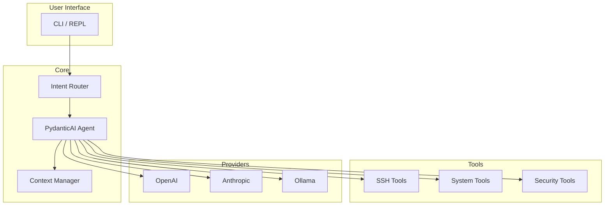

# Architecture Decisions

Key architectural decisions and their rationale.

## Overview

Merlya is built on a modular architecture designed for extensibility, security, and ease of use.



## ADR-001: PydanticAI for Agent Framework

**Status:** Accepted

**Context:** We needed a framework for building LLM-powered agents with tool calling capabilities.

**Decision:** Use PydanticAI as the agent framework.

**Rationale:**
- Type-safe with Pydantic models
- Native async support
- Clean tool definition API
- Multi-provider support
- Active development and community

**Consequences:**
- Dependency on PydanticAI
- Benefits from upstream improvements
- May need to adapt to API changes

---

## ADR-002: AsyncSSH for SSH Connections

**Status:** Accepted

**Context:** SSH connectivity is core to Merlya's functionality.

**Decision:** Use asyncssh for all SSH operations.

**Rationale:**
- Pure Python, no external dependencies
- Async-native for concurrent connections
- Full SSH2 protocol support
- Jump host support built-in
- Active maintenance

**Consequences:**
- Async-only API
- Connection pooling needed for performance
- Memory overhead for many connections

---

## ADR-003: Connection Pooling

**Status:** Accepted

**Context:** Frequent SSH connections are slow and resource-intensive.

**Decision:** Implement connection pooling with automatic cleanup.

**Rationale:**
- Avoid connection overhead for repeated commands
- Limit concurrent connections
- Automatic cleanup of idle connections
- Graceful shutdown handling

**Implementation:**
```python
class SSHPool:
    max_connections: int = 10
    idle_timeout: int = 300  # 5 minutes

    async def get_connection(host) -> SSHConnection
    async def release_connection(conn)
    async def cleanup_idle()
```

---

## ADR-004: Keyring for Credential Storage

**Status:** Accepted

**Context:** API keys and credentials need secure storage.

**Decision:** Use the system keyring (via `keyring` library).

**Rationale:**
- OS-level security (Keychain, Secret Service, Credential Manager)
- No plaintext secrets in config files
- Standard cross-platform solution
- Fallback to in-memory with warning

**Consequences:**
- Requires keyring backend on Linux
- May need user interaction for first-time setup
- Headless servers need alternative setup

---

## ADR-005: Local Intent Classification

**Status:** Accepted

**Context:** Not all user inputs require LLM processing.

**Decision:** Use ONNX-based local classifier for intent routing.

**Rationale:**
- Fast (< 10ms) classification
- No API calls for simple intents
- Works offline
- Reduces API costs

**Implementation:**
```
User Input → Intent Classifier → [Simple Intent] → Direct Handler
                              → [Complex Intent] → LLM Agent
```

**Consequences:**
- Additional model file (~50MB)
- Needs training data for new intents
- May misclassify edge cases

---

## ADR-006: TOML Configuration

**Status:** Accepted

**Context:** Configuration needs to be human-readable and editable.

**Decision:** Use TOML for configuration files.

**Rationale:**
- Human-friendly syntax
- Good Python support (tomllib in stdlib)
- Hierarchical structure
- Comments supported
- Industry standard for Python projects

**File Locations:**
- `~/.config/merlya/config.toml` - Main config
- `~/.config/merlya/hosts.toml` - SSH hosts

---

## ADR-007: Plugin Architecture

**Status:** Proposed

**Context:** Users need to extend Merlya with custom tools.

**Decision:** Entry-point based plugin system.

**Rationale:**
- Standard Python packaging approach
- Easy distribution via PyPI
- Namespace isolation
- Lazy loading

**Proposed Interface:**
```python
# pyproject.toml
[project.entry-points."merlya.tools"]
my_tool = "my_package:MyTool"

# Implementation
class MyTool(MerlyaTool):
    name = "my_tool"
    description = "Does something useful"

    async def execute(self, params: dict) -> ToolResult:
        ...
```

---

## ADR-008: Structured Logging

**Status:** Accepted

**Context:** Debugging and monitoring require good logging.

**Decision:** Use structlog for structured logging.

**Rationale:**
- Structured output (JSON for production)
- Human-readable for development
- Context binding for request tracing
- Performance optimized

**Log Levels:**
- DEBUG: Detailed execution flow
- INFO: Key operations and results
- WARNING: Recoverable issues
- ERROR: Failures requiring attention

---

## ADR-009: Multi-Provider LLM Support

**Status:** Accepted

**Context:** Users have different LLM provider preferences.

**Decision:** Abstract LLM provider interface with multiple implementations.

**Supported Providers:**
- OpenAI (GPT-4o, GPT-4o-mini)
- Anthropic (Claude 3.5)
- Ollama (local models)
- Groq (fast inference)

**Interface:**
```python
class LLMProvider(Protocol):
    async def generate(prompt: str) -> str
    async def generate_with_tools(prompt: str, tools: list) -> ToolCall
```

---

## ADR-010: Security Model

**Status:** Accepted

**Context:** Merlya executes commands on remote systems.

**Decision:** Implement defense-in-depth security model.

**Layers:**
1. **Credential Protection** - Keyring storage
2. **Command Review** - User confirmation for destructive commands
3. **Input Validation** - Pydantic models for all inputs
4. **Audit Logging** - All commands logged
5. **Principle of Least Privilege** - Minimal permissions

**Dangerous Command Detection:**
```python
DANGEROUS_PATTERNS = [
    r"rm\s+-rf",
    r"mkfs",
    r"dd\s+if=",
    r">\s*/dev/",
    r"chmod\s+777",
]
```

---

## Future Considerations

### Under Evaluation

- **WebSocket support** for real-time streaming
- **Kubernetes integration** via kubectl
- **Terraform integration** for IaC
- **Metrics collection** for monitoring dashboards

### Rejected

- **GUI Application** - Focus on CLI/API for automation
- **Custom LLM training** - Too resource-intensive for scope
- **Multi-tenant SaaS** - Security complexity, out of scope
